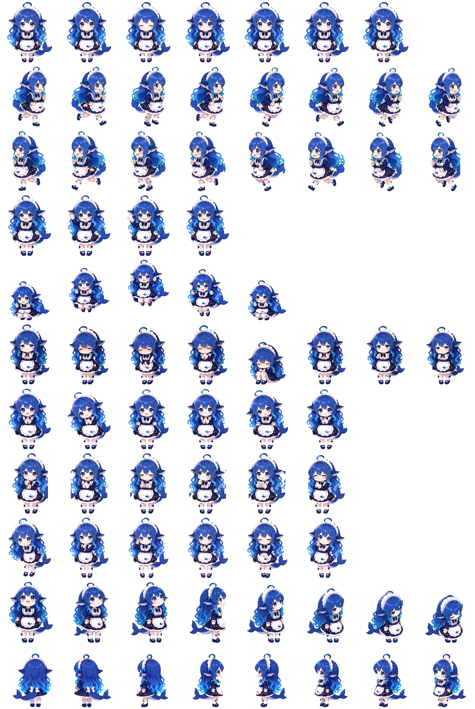

# 蓝色大肥鱼 · DeepSeek Codex Pet

一个以 DeepSeek 为灵感、以深海鲸鱼为主题的蓝发二次元女仆助手宠物，适用于 Codex v2 动画宠物精灵表格式。

> 非 DeepSeek 官方产品，也未得到 DeepSeek 官方授权或背书。本项目仅作为个人同人创作与 Codex 宠物素材分享。



## 特性

- Codex animated pet v2 格式
- 8 列 × 11 行，共 88 个动画帧槽位
- 单帧尺寸：`192 × 208`
- 精灵表尺寸：`1536 × 2288`
- 包含 9 组标准动作
- 包含按顺时针排列的 16 个视角方向
- 角色设定统一为蓝发、深海鲸鱼主题、可爱二次元女仆风格
- 精灵表使用透明背景，适合直接作为宠物素材加载

## 安装

### Windows

下载或克隆本仓库后，在仓库目录中打开 PowerShell，执行：

```powershell
$petDir = Join-Path $env:USERPROFILE ".codex\pets\deepseek"
New-Item -ItemType Directory -Force $petDir | Out-Null
Copy-Item ".\pet.json", ".\spritesheet.webp" -Destination $petDir -Force
```

默认安装位置为：

```text
C:\Users\<你的用户名>\.codex\pets\deepseek\
```

### macOS / Linux

在仓库目录中执行：

```bash
mkdir -p ~/.codex/pets/deepseek
cp pet.json spritesheet.webp ~/.codex/pets/deepseek/
```

默认安装位置为：

```text
~/.codex/pets/deepseek/
```

如果目标位置已经存在同名宠物，建议先备份原有的 `pet.json` 和 `spritesheet.webp`。文件复制完成后，重新启动或刷新 Codex，使宠物资源重新加载。

## 动画行映射

精灵表以从上到下的顺序排列动画行，每行包含 8 个帧槽位：

| 行号 | 动画 | 说明 |
| ---: | --- | --- |
| 0 | `idle` | 待机、呼吸和眨眼等轻微动作 |
| 1 | `running-right` | 向屏幕右侧移动 |
| 2 | `running-left` | 向屏幕左侧移动 |
| 3 | `waving` | 挥手 |
| 4 | `jumping` | 跳跃 |
| 5 | `failed` | 任务失败或沮丧状态 |
| 6 | `waiting` | 等待用户确认或输入 |
| 7 | `running` | 工作中、处理任务或专注思考 |
| 8 | `review` | 检查、复核或审阅状态 |
| 9 | 视角方向 `000`–`157.5` | 上方至右下方之间的 8 个方向 |
| 10 | 视角方向 `180`–`337.5` | 下方至左上方之间的 8 个方向 |

16 个视角按顺时针方向排列：

```text
000      上方
022.5    右上方
045      右上方
067.5    右上方
090      屏幕右侧
112.5    右下方
135      右下方
157.5    右下方
180      下方
202.5    左下方
225      左下方
247.5    左下方
270      屏幕左侧
292.5    左上方
315      左上方
337.5    左上方
```

## 文件结构

```text
deepseek/
├── README.md
├── pet.json
└── spritesheet.webp
```

### `pet.json`

```json
{
  "id": "deepseek",
  "displayName": "蓝色大肥鱼",
  "description": "一位蓝发、深海鲸鱼主题的可爱二次元女仆助手宠物，来自deepseek。",
  "spriteVersionNumber": 2,
  "spritesheetPath": "spritesheet.webp"
}
```

### `spritesheet.webp`

动画精灵表。每个单元格为 `192×208`，从左到右为同一动画行的 8 个帧，从上到下依次为上方表格中的 11 行。

## 角色设定

蓝色长发、鲸鱼尾巴与深海配色是角色的主要识别元素；白色女仆围裙、蓝色服装和海洋感细节用于保持整体主题统一。角色在不同动作和视角中尽量保持相同的脸部比例、发型、服装、尾巴和配色。

## 许可证与使用说明

本仓库当前未附带独立的开源许可证，因此默认不授予商业使用、再授权、改编发行或品牌背书权利。

你可以将它作为个人 Codex 宠物素材使用和分享；如果要用于商业项目、公开产品、品牌宣传或其他可能产生误认的场景，请先确认相关角色、名称和视觉元素的权利状态，并避免暗示与 DeepSeek 存在官方合作关系。

## 反馈

如果你发现精灵表尺寸、动画行顺序、透明背景或 Codex 加载兼容性方面的问题，欢迎提交 Issue，并附上：

- 使用的 Codex / 宠物加载环境
- 操作系统
- 具体异常表现
- 相关截图或日志

